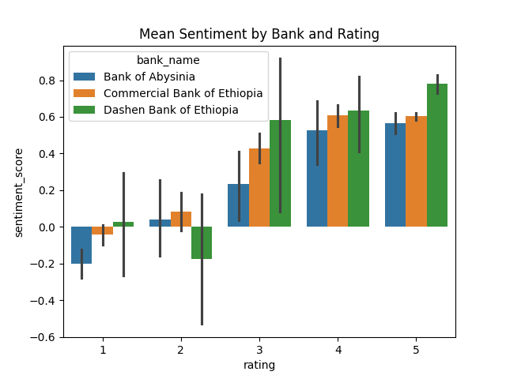

### 📈 Customer Experience Analytics for Fintech Apps

This project analyzing customer satisfaction with mobile banking apps by collecting and processing user reviews from the Google Play Store for three Ethiopian banks:

- Commercial Bank of Ethiopia (CBE)
- Bank of Abyssinia (BOA)
- Dashen Bank

### 🧠 Project Overview

The analysis is structured into four main tasks:

1. Data Collection and Preprocessing:

- Use google-play-scraper to collect reviews, ratings, dates, and app names for three banks.
- Remove duplicates, handle missing data, Normalize dates (e.g., to YYYY-MM-DD) and save csv.

2. Sentiment and Thematic Analysis:

- Perform sentiment analysis using VADER and TextBlob.
- Apply keyword extraction and topic modeling to identify recurring themes.

3. Store Cleaned Data in Oracle:

- Design and implement a relational database in Oracle to persistently store the cleaned and processed review data.

4. Insights and Recommendations:

- Visualize trends and sentiments.
- Provide actionable recommendations to improve user experience based on insights.

### 📁 Repository Structure

The repository is organized as follows:

```
Customer-Experience-Analytics-for-Fintech-Apps/
├── .github/                # GitHub workflows and CI
│   └── workflows/
├── .vscode/                # Editor settings
├── notebooks/
│   └── eda.ipynb           # EDA and analysis
├── scripts/
│   └── scrapeDataFromPlayStore.py # script to scrape data from google play store
├── src/                    # Core source code: data processing, sentiment, DB
│   ├── dataProcessing.py
│   ├── sentimentAnalysis.py
│   └── database.py
├── tests/                  # Unit tests
├── output/                 # plot will be saved here
├── utils/
│   ├── logger.py           # logger file
│   └── visualization.py    # visualization plots goes here
├── .gitignore
├── README.md
└── requirements.txt
```

🛠️ Installation and Setup
Follow these steps to set up the project locally:

1. Clone the Repository:

```
git clone https://github.com/befkir/Customer-Experience-Analytics-for-Fintech-Apps
cd Customer-Experience-Analytics-for-Fintech-Apps
```

2. Create and Activate a Virtual Environment:

```
python -m venv venv
source venv/bin/activate  # On Windows: venv\Scripts\activate
```

3. Install Dependencies:

```
pip install -r requirements.txt
```

4. Run the script:

- `cd Scripts`
- `python3 scrapeDataFromPlayStore.py`

5. Run the Jupyter Notebook:

```
jupyter notebook
```

### 🧰 Tools and Libraries

The project utilizes the following tools and libraries:

- Python: Primary programming language.

- Pandas: Data manipulation and analysis.

- Matplotlib & Seaborn: Data visualization.

- TextBlob: a simple API for diving into common NLP tasks such as part-of-speech tagging, noun phrase extraction, sentiment analysis, classification, and more.

- VADER Sentiment Analysis: Analyzing sentiment of review text.

## Sentiment Analysis Visualizations

Here are sample outputs from the sentiment analysis project:

### 1. Sentiment Distribution (Bank of Abyssinia)


### 2. Rating Distribution Comparison


### 3. Mean Sentiment



### 🤝 Contributing

Contributions are welcome! If you'd like to contribute:

1. Fork the Repository:

Click the "Fork" button at the top right of the repository page.

2. Clone Your Fork:

```
git clone https://github.com/befkir/Customer-Experience-Analytics-for-Fintech-Apps
```

3. Create a New Branch:

```
git checkout -b feature/your-feature-name
Make Your Changes:
```

4. Implement your feature or fix the bug.

Commit and Push:

```
git add .
git commit -m "Description of your changes"
git push origin feature/your-feature-name
```

5. Submit a Pull Request:
   Open a pull request on GitHub to merge your changes into the main branch.
